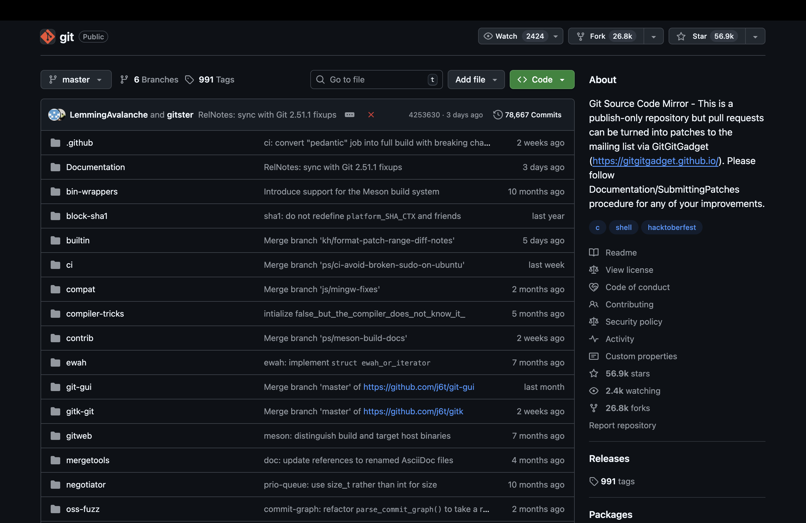
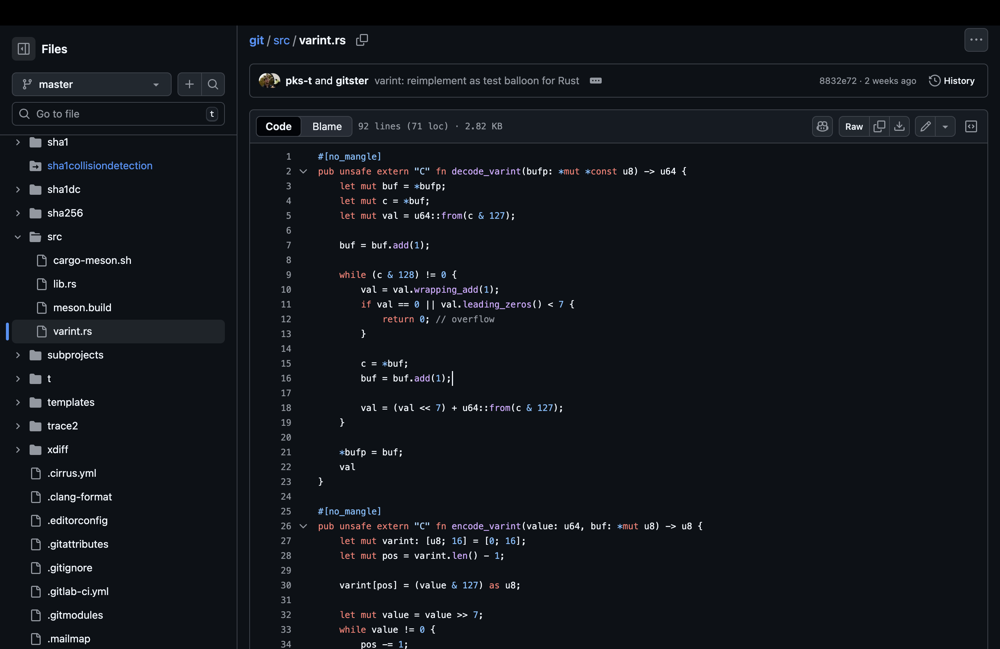

## TL;DR

Already familiar with git? Need a shorter version? Use this cheat sheet instead.

---

## Intro

Git is the most popular and powerful version control system, used from local to remote repos. Don't know how to use it yet? Don't worry, this quick guide is for everyone.

## Names that you must know

* Git: The version control system.
* repository(repo): The storage of your codebase, recording all the changes in your codes. You can have local repos and remote repos at the same time to keep your code safe.
* GitHub: A developer platform that allows developers to create, store, manage, and share their code. You can view others' repos or create your remote repo on GitHub.
* git add: Add file contents to the cache.
* git commit: Create a commission on git. We'll talk about what is a commission later.
* git push: Pushes the local repo status to the remote repo.
* git pull: Pulls the remote repo status to the local repo.
* git clone: Clone a remote repo. Thats how you can start to work on an existing remote repo!

It might seems to be a lot of new words! No need for worries, we will start explaining the whole workflow right below.

## Cloning a remote repo

Imagine you just joined a new coding team/IT company. Your job is to read a repo(I used git for example in this guide) and to understand its mechanism. What should you do?


**Let's starting on!**

1. Open the link: [https://github.com/git/git](https://github.com/git/git)\
You wil probably see a website like this:


2. Start reading\
Once you are sure this is the right repo, you can start to read online. You can click files and directories to open it. GitHub provides limited syntax highlighting. For example, keywords like `pub` `unsafe` `fn` in this rust file is rendered red and function name `decode_varint` is rendered purple.


3. Clone the repo locally\
It might feel okay if you are reading a relatively small repo. However, GitHub does not support features like code navigation or shortcuts. The **better** way to read a bigger repo is to clone the repo locally. Click on the green `Code` button first.\

**Note**: We assume that the repo you want to read is **public**. If the repo you need to clone is private, you will need further authentication, which is not included in this guide😀.\
You can see there is a `HTTPS` tab and a `SSH` tab. SSH is preferred than HTTPS in GitHub. You can click the board button to copy url to your clipboard.\
Then, open the directory to clone the remote repo. For example, if your current directory is `/path/`, then start cloning here will create a directory called `/path/git/`.\
To clone the repo, open your cmd and type `git clone <url>`, which `url` is `git@github.com:git/git.git` in this example.\
If the successful, you will see output like this:

``` Bash
Cloning into 'git'...
remote: Enumerating objects: 61, done.
remote: Counting objects: 100% (61/61), done.
remote: Compressing objects: 100% (46/46), done.
remote: Total 61 (delta 4), reused 61 (delta 4), pack-reused 0 (from 0)
Receiving objects: 100% (61/61), 44.63 KiB | 737.00 KiB/s, done.
Resolving deltas: 100% (4/4), done.
```

Congratulations! You have successfully cloned the remote repo into your device! You can start reading the code locally in `path/git/` right now.

**Do you know?**\
If you have installed *Visual Studio Code(VSCode)*, you can also type `cd ./git` then `code .` to open the repo immediately!
