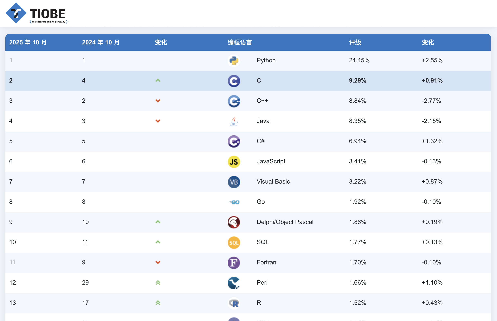

## What is Go?

As it is described on official Golang [website](https://go.dev/), Go is

- [x] An open-source programming language supported by Google
- [x] Easy to learn and great for teams
- [x] Built-in concurrency and a robust standard library
- [x] Large ecosystem of partners, communities, and tools

Also, according to Stack Overflow and TIOBE, Go is popular(even greater than Pascal, SQL, and Rust!) and widely admired(23.1%) among developers.




What makes Go different?

## Key features of Golang

### Super Simple Syntax

Unlike Rust, C++, or Java, the syntax of Go is fully designed with simplicity and readability. Here is an example of helloworld:

``` Go
package main
import (
    "fmt"
)

func main() {
    fmt.Println("Hello World!");
}

```

In Go, no semicolon is needed. Every "{"(left curly bracket) must not be on the next line. "go fmt" enforces everyone's code to be with the same style, which significantly improve the ease to read and write codes.

### Error Handling

In Go, there is no Java/C++-like "try-catch-throw", or Rust/Haskell-like "Either/Result" types, all you need is just "Error". [Errors are just values](https://go.dev/blog/errors-are-values), and we should respect that. Dealing with "try-catch-throw" makes you just want to ignore the error handling, throwing it to the outer space until your program crashes; Wanna to deal with "Either/Result"? You probably gonna either become a master of `unwrap()` if you are using Rust or otherwise painfully learn "What are monads and how can we use them?" if you are using Haskell.

I didn't like the error handling of Go a lot at first. However, it is actually a balance of "try-catch-throw" and "Either/Result". As the example below, one easy-to-see benefit of that is you can handle errors without interrupting your control flow.

``` Go
package main
import (
    "errors"
    "fmt"
)

func f(arg int) (int, error) {
    if arg == 42 {
        return -1, errors.New("can't work with 42")
    }
    return arg + 3, nil
}

func main() {
    for _, i := range []int{7, 42} {
        if r, e := f(i); e != nil {
            fmt.Println("f failed:", e)
        } else {
            fmt.Println("f worked:", r)
        }
    }
}
```

### Concurrency

If the concurrency in Rust can be described as totally ["Fearless"](https://doc.rust-lang.org/book/ch16-00-concurrency.html), then the concurrency in Go should be described as totally "Effortless". Rust has a lot of great tools to support concurrency models, but since Rust doesn't provide any official asynchronous runtimes, you still have to write numerous "async" and ".await" in your Rust programs. Plus, you have to choose runtime carefully since you can't run functions on different runtimes.

However, in Go, garbage collection and asynchronous runtime, the "Gorountine", are both out-of-the-box. No need to declare any function/closure as "async". Just write and use it, smoothly and seamlessly as normal functions. Here's an example:

``` Go
package main

import (
    "fmt"
    "time"
)

func f(from string) {
    for i := range 3 {
        fmt.Println(from, ":", i)
    }
}

func main() {

    f("direct")

    go f("goroutine")

    go func(msg string) {
        fmt.Println(msg)
    }("going")

    time.Sleep(time.Second)
    fmt.Println("done")
}
```

Another highlight of concurrent programming in Go is the Communicating Sequential Processes (CSP) model which emphasize "Do not communicate by sharing memory; instead, share memory by communicating."
